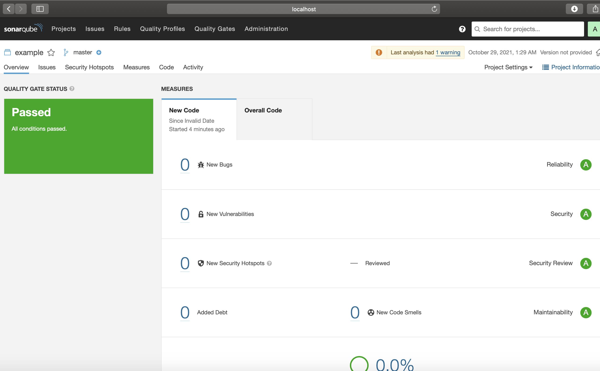

# Домашнее задание к занятию "09.02 CI\CD"

https://github.com/netology-code/mnt-homeworks/tree/master/09-ci-02-cicd


## 1. SonarQube



## 2. Nexus

```xml
<metadata modelVersion="1.1.0">
<groupId>netology</groupId>
<artifactId>java</artifactId>
<versioning>
<latest>8_282</latest>
<release>8_282</release>
<versions>
<version>8_102</version>
<version>8_282</version>
</versions>
<lastUpdated>20211029102901</lastUpdated>
</versioning>
</metadata>
```

## 3. Maven

pom.yml:
```xml
<project xmlns="http://maven.apache.org/POM/4.0.0" xmlns:xsi="http://www.w3.org/2001/XMLSchema-instance"
  xsi:schemaLocation="http://maven.apache.org/POM/4.0.0 http://maven.apache.org/xsd/maven-4.0.0.xsd">
  <modelVersion>4.0.0</modelVersion>

  <groupId>com.netology.app</groupId>
  <artifactId>simple-app</artifactId>
  <version>1.0-SNAPSHOT</version>
    <repositories>
     <repository>
       <id>my-repo</id>
       <name>maven-releases</name>
       <url>http://localhost:8081/repository/maven-releases/</url>
     </repository>
   </repositories>
  <dependencies>
    <dependency>
      <groupId>netology</groupId>
      <artifactId>java</artifactId>
      <version>8_282</version>
      <classifier>distrib</classifier>
      <type>tar.gz</type>
    </dependency>
  </dependencies>
</project>

```

