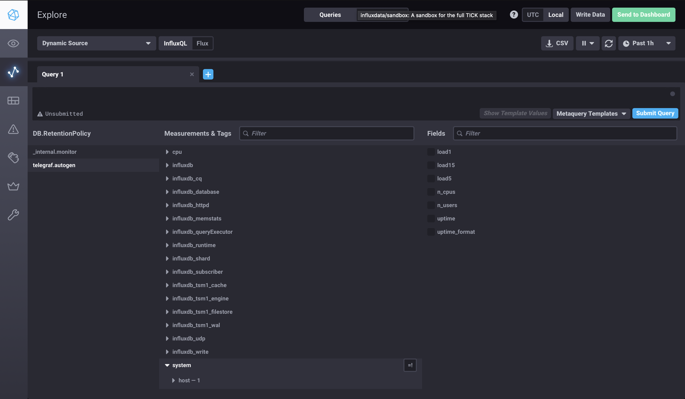

## Домашнее задание к занятию "10.02. Системы мониторинга"
https://github.com/netology-code/mnt-homeworks/tree/master/10-monitoring-02-systems

### Задание 1
Опишите основные плюсы и минусы pull и push систем мониторинга:

Push:
* Гибкая настройка отправки пакетов с метриками +
* Упрощение репликации данных и их резервных копий +
* UDP менее затратный способ передавать данные +
* Без гарантий доставки -

Pull:
* Можно настроить единый proxy-server до всех агентов с TLS +
* Гарантия опроса только тех агентов, которые настроены в системе мониторинга +
* Упрощенная отладка получения данных с агентов +
* Нагрузка на сеть во время сбора данных -

### Задание 2
Prometheus - pull

TICK - push

Zabbix - гибрид

VictoriaMetrics - гибрид

Nagios - pull

### Задание 3

### Задание 4
!!! Не могу вообще найти disk->host->telegraf_container_id:

### Задание 5

